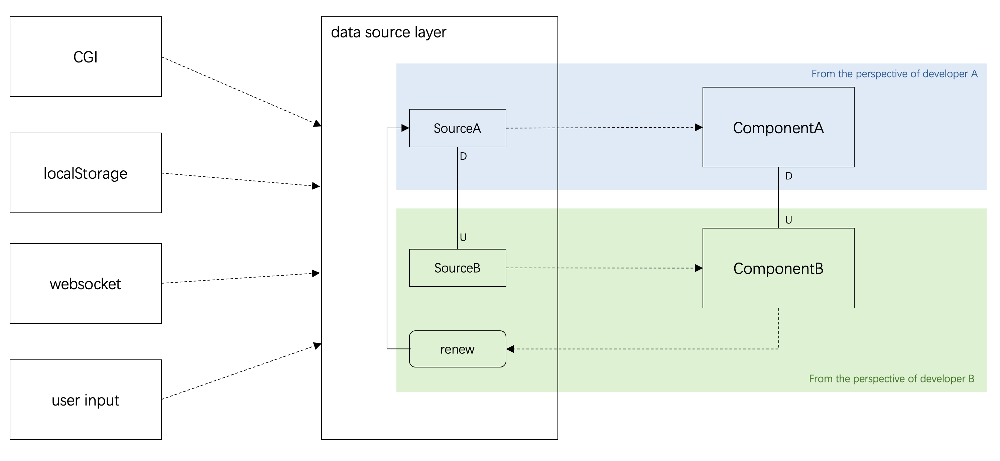

# FODS (Frontend Operational Data Store)

Frontend data source management excellent tool, which abstractly encapsulates the entire lifecycle of front-end data requests, caching, usage, and updates into an independent data source layer. It provides a unique perspective to avoid complex issues in data requests at the code level.

When working on front-end development and needing to interact with data, without effective data management, it can lead to retrieving data from various sources, thus losing focus on the current business. With FODS, for specific business development, developers only need to be concerned with the data related to the current code block, without pulling out irrelevant contextual data. Through the management of the data source layer, data constructs its own dependency relationships and the lifecycle related to updates. This concept of focusing only on the relevant parts helps achieve isolation between modules, hiding the potential data connections behind the data layer. As a result, developers experience reduced mental burden and avoid being overwhelmed by the intricate details of these relationships.

If you are developer B, you do not need to care source A, even though some data of B is from A. Data source layer define the relationships between A and B, developers only pick B to use it, and invoke renew method to pull new data to refresh the data source store, and the data source mutation will affect B and later affect component B. From the perspective of developer B, he/she is only facing data source store, even do not know the exisiting of source A, and do not need to care the data source of component A any more.

As an independent library, FODS is lightweight and does not depend on any third-party libraries. It exports ESModule specifications by default, allowing you to use it in various JavaScript environments such as web and Node.js. Additionally, it provides support for React and Vue, making it convenient to use seamlessly within these two frameworks.

| Libaray    |  Supports |                                    |
|------------|:---------:|-----------------------------------:|
| fods       |           |    [Link](./packages/fods)         |
| fods-react |  react    |    [Link](./packages/fods-react)   |
| fods-vue   |  vue      |    [Link](./packages/fods-vue)     |

## MIT License

Copyright (c) 2024 Shuang Tang

Permission is hereby granted, free of charge, to any person obtaining a copy of this software and associated documentation files (the "Software"), to deal in the Software without restriction, including without limitation the rights to use, copy, modify, merge, publish, distribute, sublicense, and/or sell copies of the Software, and to permit persons to whom the Software is furnished to do so, subject to the following conditions:

The above copyright notice and this permission notice shall be included in all copies or substantial portions of the Software.

THE SOFTWARE IS PROVIDED "AS IS", WITHOUT WARRANTY OF ANY KIND, EXPRESS OR IMPLIED, INCLUDING BUT NOT LIMITED TO THE WARRANTIES OF MERCHANTABILITY, FITNESS FOR A PARTICULAR PURPOSE AND NONINFRINGEMENT. IN NO EVENT SHALL THE AUTHORS OR COPYRIGHT HOLDERS BE LIABLE FOR ANY CLAIM, DAMAGES OR OTHER LIABILITY, WHETHER IN AN ACTION OF CONTRACT, TORT OR OTHERWISE, ARISING FROM, OUT OF OR IN CONNECTION WITH THE SOFTWARE OR THE USE OR OTHER DEALINGS IN THE SOFTWARE.
